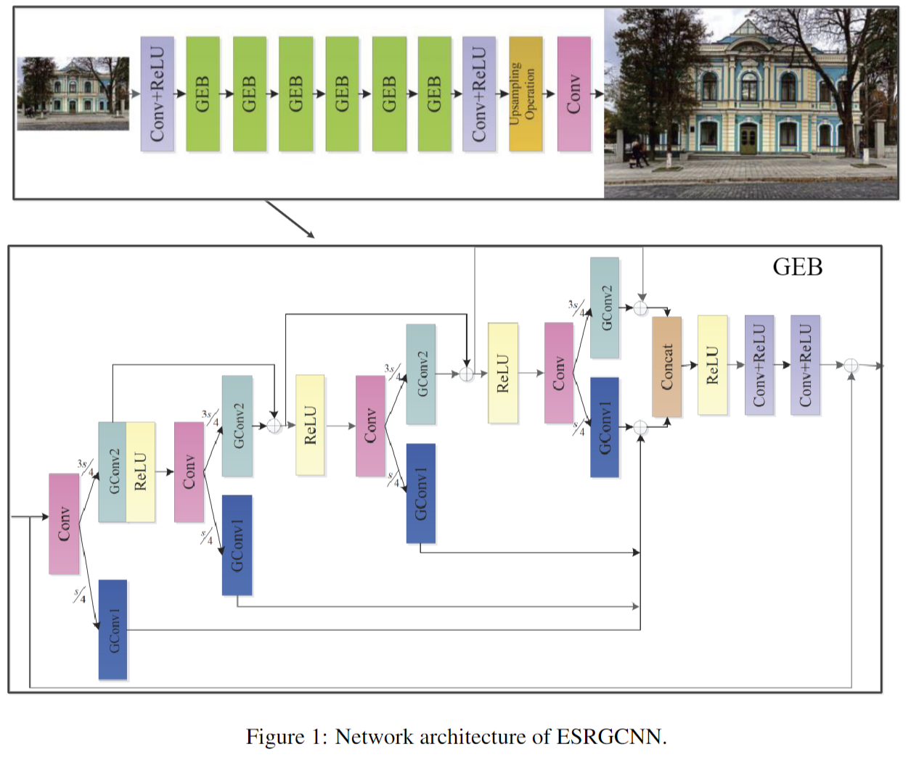
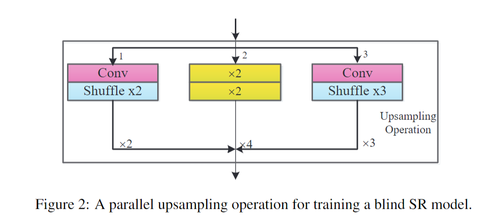
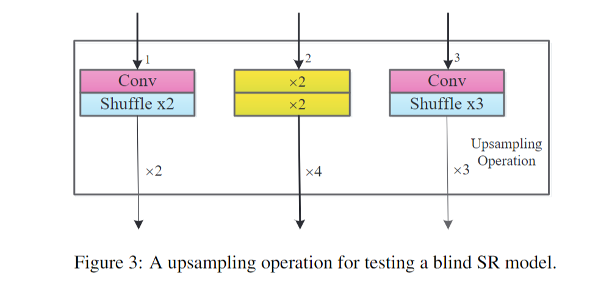
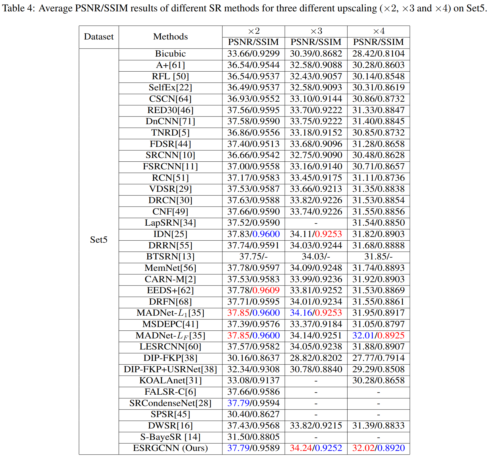
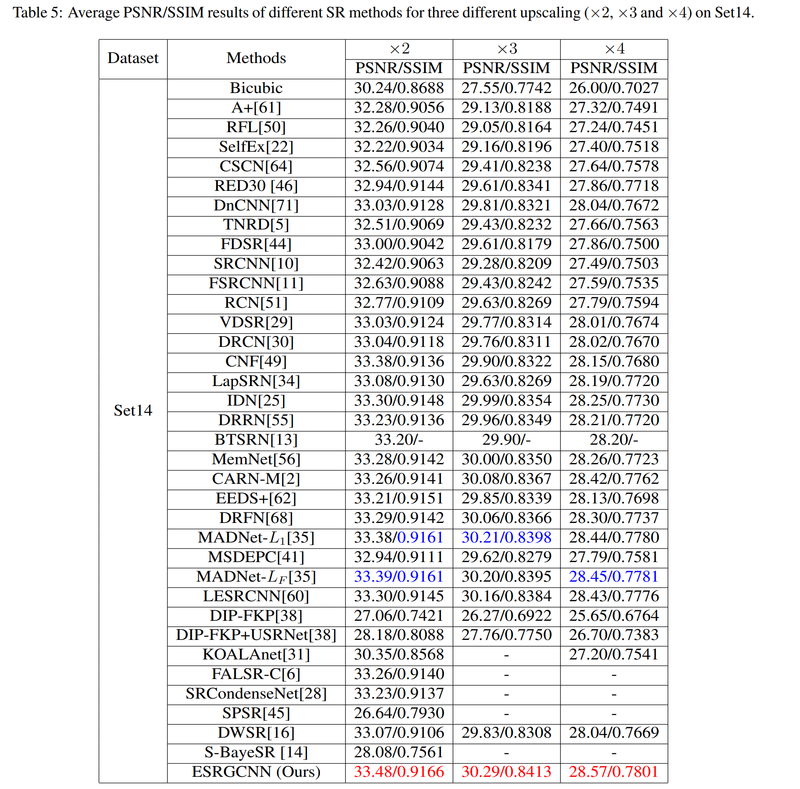
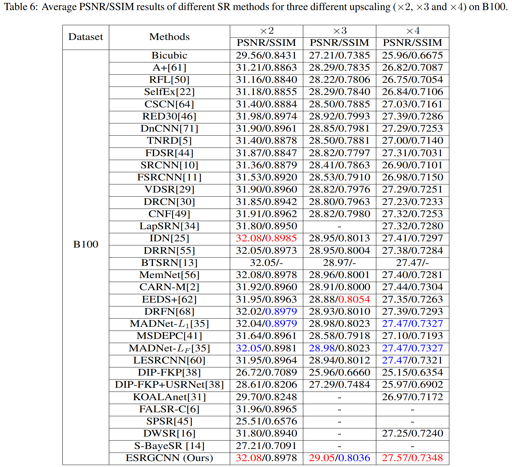
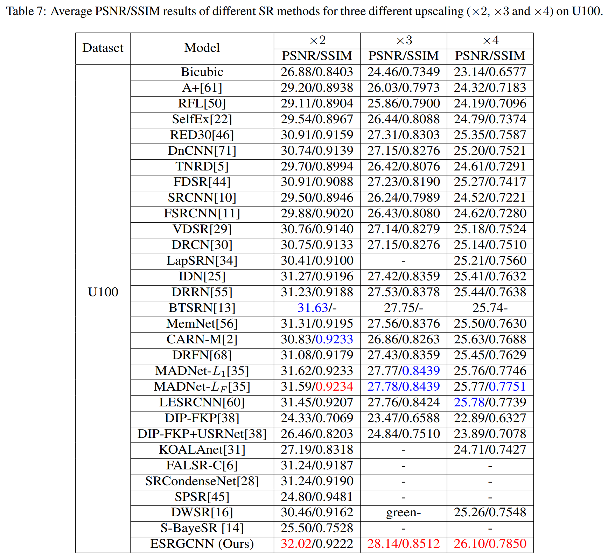
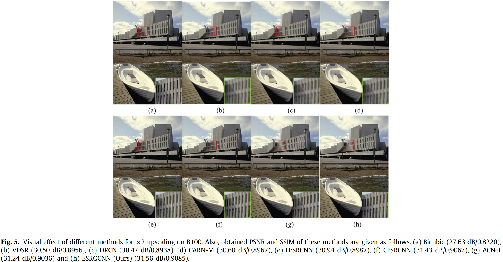

## Image Super-resolution with An Enhanced Group Convolutional Neural Network is proposed by Chunwei Tian, Yixuan Yuan, Shichao Zhang, Chia-Wen Lin, Wangmeng Zuo, David Zhang, 2021. It is implemented by Pytorch. And this work is obtained at https://arxiv.org/pdf/2205.14548. This paper is reported by the 52CV at https://mp.weixin.qq.com/s/Y4SOhhkx9OvCBYAURAIRsw and AIWalker at https://mp.weixin.qq.com/s/uK0S6pGynfhWyhe0Vx64XA. This paper is accepted by the Neural Networks (CCF B/SCI-IF:8.05) in 2022. 

## This paper uses group convolutions and residual operations to enhance deep and wide correlations of different channels to implement an efficient SR network.

## Absract
#### CNNs with strong learning abilities are widely chosen to resolve super-resolution problem. However, CNNs depend on deeper network architectures to improve performance of image super-resolution, which may increase computational cost in general. In this paper, we present an enhanced super-resolution group CNN (ESRGCNN) with a shallow architecture by fully fusing deep and wide channel features to extract more accurate low-frequency information in terms of correlations of different channels in single image super-resolution (SISR). Also, a signal enhancement operation in the ESRGCNN is useful to inherit more long-distance contextual information for resolving long-term dependency. An adaptive up-sampling operation is gathered into a CNN to obtain an image super-resolution model with low-resolution images of different sizes. Extensive experiments report that our ESRGCNN surpasses the state-of-the-arts in terms of SISR performance, complexity, execution speed, image quality evaluation and visual effect in SISR. Code is found at https://github.com/hellloxiaotian/ESRGCNN.

## Requirements (Pytorch)  
#### Pytorch 0.41

#### Python 2.7

#### torchvision

#### torchsummary

#### openCv for Python

#### HDF5 for Python

#### Numpy, Scipy

#### Pillow, Scikit-image

#### importlib

## Commands
### Training datasets

#### The training dataset is downloaded at https://pan.baidu.com/s/1uqdUsVjnwM_6chh3n46CqQ （secret code：auh1）(baiduyun) or https://drive.google.com/file/d/1TNZeV0pkdPlYOJP1TdWvu5uEroH-EmP8/view (google drive)

### Test datasets

#### The test dataset of Set5 is downloaded at 链接：https://pan.baidu.com/s/1YqoDHEb-03f-AhPIpEHDPQ (secret code：atwu) (baiduyun) or https://drive.google.com/file/d/1hlwSX0KSbj-V841eESlttoe9Ew7r-Iih/view?usp=sharing (google drive)

#### The test dataset of Set14 is downloaded at 链接：https://pan.baidu.com/s/1GnGD9elL0pxakS6XJmj4tA (secret code：vsks) (baiduyun) or https://drive.google.com/file/d/1us_0sLBFxFZe92wzIN-r79QZ9LINrxPf/view?usp=sharing (google drive)

#### The test dataset of B100 is downloaded at 链接：https://pan.baidu.com/s/1GV99jmj2wrEEAQFHSi8jWw （secret code：fhs2) (baiduyun) or https://drive.google.com/file/d/1G8FCPxPEVzaBcZ6B-w-7Mk8re2WwUZKl/view?usp=sharing (google drive)

#### The test dataset of Urban100 is downloaded at 链接：https://pan.baidu.com/s/15k55SkO6H6A7zHofgHk9fw (secret code：2hny) (baiduyun) or https://drive.google.com/file/d/1yArL2Wh79Hy2i7_YZ8y5mcdAkFTK5HOU/view?usp=sharing (google drive)

### preprocessing

### cd dataset

### python div2h5.py

### Training a model for different scales (also regarded as blind SR)

#### python esrgcnn/train.py --patch_size 83 --batch_size 32 --max_steps 600000 --decay 400000 --model esrgcnn --ckpt_name esrgcnn --ckpt_dir checkpoint/esrgcnn --scale 0 --num_gpu 1

### Using a model to test different scales of 2,3 and 4 (also regarded as blind SR)

#### python tcw_sample_b.py --model esrgcnn --test_data_dir dataset/urban100 --scale 2 --ckpt_path checkpoint/esrgcnn.pth --sample_dir samples_singlemodel_urban100_x2

#### python tcw_sample_b.py --model esrgcnn --test_data_dir dataset/urban100 --scale 3 --ckpt_path checkpoint/esrgcnn.pth --sample_dir samples_singlemodel_urban100_x3

#### python tcw_sample_b.py --model esrgcnn --test_data_dir dataset/urban100 --scale 4 --ckpt_path checkpoint/esrgcnn.pth --sample_dir samples_singlemodel_urban100_x4

### 1. Network architecture of ESRGCNN.

### 2. A parallel upsampling operation for training a blind SR model.

### 3. A upsampling operation for testing a blind SR model.

### 4. ESRGCNN for x2, x3 and x4 on Set5.

### 5. ESRGCNN for x2, x3 and x4 on Set14.

### 6. ESRGCNN for x2, x3 and x4 on B100.

### 7. ESRGCNN for x2, x3 and x4 on U100.

### 8. ESRGCNN for x2 on B100

### 9. Running time of different methods on hr images of size 256x256, 512x512 and 1024x1024 for x2.

### 10. Complexities of different methods for x2.

### 11. ESRGCNN for x2, x3 and x4 on B100 about FSIM

### 12. Visual results of U100 for x3.

### 13. Visual results of B100 for x2.

### If you want to cite this paper, please refer to the following formats:
#### 1. Tian C, Yuan Y, Zhang S, et al. Image Super-resolution with An Enhanced Group Convolutional Neural Network[J]. arXiv preprint arXiv:2205.14548, 2022.
#### 2. @article{tian2022image,
####    title={Image Super-resolution with An Enhanced Group Convolutional Neural Network},
####    author={Tian, Chunwei and Yuan, Yixuan and Zhang, Shichao and Lin, Chia-Wen and Zuo, Wangmeng and Zhang, David},
####    journal={arXiv preprint arXiv:2205.14548},
####    year={2022}
###     }
